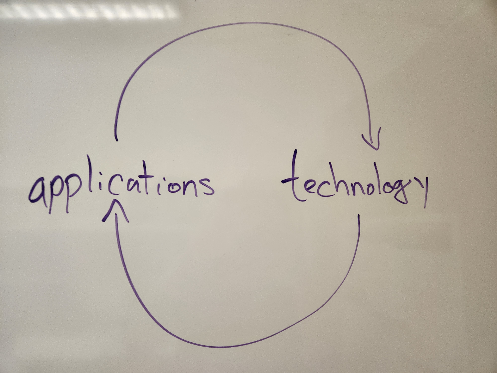

---
jupytext:
  formats: md:myst,ipynb
  text_representation:
    extension: .md
    format_name: myst
    format_version: 0.13
    jupytext_version: 1.16.7
kernelspec:
  display_name: Python 3 (ipykernel)
  language: python
  name: python3
---

```{code-cell} ipython3
---
slideshow:
  slide_type: '-'
---
import os
from pathlib import Path
import numpy as np
import matplotlib.pyplot as plt
%matplotlib inline
```

+++ {"slideshow": {"slide_type": "slide"}}

<center>

# Scientific Open Source Software - Bridging the Gap between Researcher and Developer

## Caltech Software Accelerator | March 21st 2025

### Ross Barnowski, [@rossbar](https://github.com/rossbar) on GitHub

</center>

+++ {"slideshow": {"slide_type": "slide"}}

# My perspective

+++ {"slideshow": {"slide_type": "subslide"}}

## Software *for* engineering

+++ {"slideshow": {"slide_type": "fragment"}}

(engineering research, that is)

+++ {"slideshow": {"slide_type": "fragment"}}

(oh and science too!)

+++ {"slideshow": {"slide_type": "fragment"}}

## The *R* is the defining element of *RSE*

+++ {"slideshow": {"slide_type": "subslide"}}

## Software as...

+++ {"slideshow": {"slide_type": "fragment"}}

 - A tool for exploration, intuition-building, formulating hypotheses, understanding constraints

+++ {"slideshow": {"slide_type": "fragment"}}

 - A means of organizing and effectively communicating ideas

+++ {"slideshow": {"slide_type": "fragment"}}

 - Stable building blocks for new ideas

+++ {"slideshow": {"slide_type": "slide"}}

## The infinite bootstrapping of empirical knowledge

<center>
 Technology"
     width=40%
/>
</center>

+++ {"slideshow": {"slide_type": "slide"}}

## Exploratory data analysis is a major component of modern research

+++ {"slideshow": {"slide_type": "fragment"}}

### Not all software needs to be sustainable

+++ {"slideshow": {"slide_type": "fragment"}}

In fact, in research - most shouldn't be!

+++ {"slideshow": {"slide_type": "subslide"}}

### Some quotes

+++ {"slideshow": {"slide_type": "fragment"}}

> ... premature optimization is the root of all evil...
>
> Donald Knuth, ["Structured Programming with go to statements"](https://dl.acm.org/doi/10.1145/356635.356640)

+++ {"slideshow": {"slide_type": "fragment"}}

- Prioritize **speed to test ideas**, not necessarily **code runtime**
  * Researcher time uber alles

+++ {"slideshow": {"slide_type": "fragment"}}

> Premature abstraction is as bad as premature optimization.
>
> Luciano Ramalho, preface to [Fluent Python](https://dl.acm.org/doi/10.5555/2876106)

+++ {"slideshow": {"slide_type": "fragment"}}

- Prioritize **Flexibility**
  * Requirements change *frequently*, *rapidly*, and *non-linearly*

+++ {"slideshow": {"slide_type": "subslide"}}

## Case study: [deepcell-label](https://label-dev.deepcell.org)

Browser-based labeling application for cellular data.

+++ {"slideshow": {"slide_type": "subslide"}}

<center>

</center>

+++ {"slideshow": {"slide_type": "slide"}}

### Some quotes

> ... premature optimization is the root of all evil...
>
> Donald Knuth, ["Structured Programming with go to statements"](https://dl.acm.org/doi/10.1145/356635.356640)

- Prioritize **speed to test ideas**, not necessarily **code runtime**
  * Researcher time uber alles

> Premature abstraction is as bad as premature optimization.
>
> Luciano Ramalho, preface to [Fluent Python](https://dl.acm.org/doi/10.5555/2876106)

- Prioritize **Flexibility**
  * Requirements change *frequently*, *rapidly*, and *non-linearly*

+++ {"slideshow": {"slide_type": "fragment"}}

- Prioritize keeping things **organized** and **portable**

+++ {"slideshow": {"slide_type": "fragment"}}

- The real reason researchers should care about `git`!

+++ {"slideshow": {"slide_type": "slide"}}

## Git for researchers

+++ {"slideshow": {"slide_type": "fragment"}}

- `git` + environment management == develop and run anywhere

+++ {"slideshow": {"slide_type": "fragment"}}

- Simplified mental model: commits as snapshots -> 
  - `branch` ing as experiment management; `tag` ing to indicate project state
    that gave interesting/unexpected results
  - Thinking in `diff` s: organizing your work so that your future self can
    understand the logic behind your changes
    - Not to mention the power of `bisect` to determine where something went
      wrong!

+++ {"slideshow": {"slide_type": "fragment"}}

- Side note: `history` and `%hist` --- never forget how you did something ever
  again!

+++ {"slideshow": {"slide_type": "slide"}}

# Effective communication

+++ {"slideshow": {"slide_type": "fragment"}}

## Reducing complexity!

+++ {"slideshow": {"slide_type": "subslide"}}

<center>

</center>

+++ {"slideshow": {"slide_type": "fragment"}}

List-mode ML-EM

+++ {"slideshow": {"slide_type": "fragment"}}

vs.

```{code-cell} ipython3
---
slideshow:
  slide_type: fragment
---
def compute_em_iteration(λ, α, s):
    term_one = 1 / (α @ λ)
    term_two = α.T @ term_one
    return (λ / s) * term_two
```

+++ {"slideshow": {"slide_type": "subslide"}}

TODO: Better yet - executable

+++ {"slideshow": {"slide_type": "fragment"}}

## Clear, concise, efficient code requires *both* experience and deep understanding of the problem

+++ {"slideshow": {"slide_type": "fragment"}}

- **Collaboration!**

+++ {"slideshow": {"slide_type": "slide"}}

# Building blocks

+++ {"slideshow": {"slide_type": "fragment"}}

## What makes software sustainable?

+++ {"slideshow": {"slide_type": "fragment"}}

### Open-source is necessary, but not sufficient!

+++ {"slideshow": {"slide_type": "subslide"}}

Another case-study: [Medsam](https://github.com/bowang-lab/MedSAM)

+++ {"slideshow": {"slide_type": "slide"}}

## What makes software sustainable?

### Open-source is necessary, but not sufficient!

+++ {"slideshow": {"slide_type": "subslide"}}

### Containerization for reproducibility

+++ {"slideshow": {"slide_type": "fragment"}}

> Docker shouldn't exist. It exists only because everything else is so
> terribly complicated that they added **another** layer of complexity to make
> it work. It's like they thought: "If deployment is bad, we should make
> development bad too!"
>
> Jack Rusher, ["Stop writing dead programs"](https://www.youtube.com/watch?v=8Ab3ArE8W3s&list=PLcGKfGEEONaDH7AwzmIQMjzWT-GnQys2z), Strangeloop 2022
> quote around the 5min mark, but watch the whole thing!

+++ {"slideshow": {"slide_type": "fragment"}}

"Shipping your machine" is not a panacea!

+++ {"slideshow": {"slide_type": "fragment"}}

- Underlying hardware changes (e.g. `aarch-64`)

+++ {"slideshow": {"slide_type": "fragment"}}

- Reproducible, but not **sustainable**
  - Force users to jump through ever more hoops as time goes on to run old code

+++ {"slideshow": {"slide_type": "slide"}}

<center>

# Okay... so what?

</center>

+++ {"slideshow": {"slide_type": "slide"}}

## Building stronger ties between open-source developer communities researchers

- Both on campus, and with the broader OSS development community

+++ {"slideshow": {"slide_type": "fragment"}}

### Why?

+++ {"slideshow": {"slide_type": "fragment"}}

Best way to learn, build expertise in underlying packages, languages, technologies

+++ {"slideshow": {"slide_type": "fragment"}}

- [A JOSS story](https://joss.theoj.org/papers/10.21105/joss.07604) - thanks Gabriele!

+++ {"slideshow": {"slide_type": "fragment"}}

So developers are aware of your use-case!

+++ {"slideshow": {"slide_type": "fragment"}}

- [Napari example](https://github.com/napari/napari/issues/5608#issuecomment-2036211498)

+++ {"slideshow": {"slide_type": "fragment"}}

- [Zarr example](https://github.com/zarr-developers/zarr-python/issues/2706#issuecomment-2686222636)

+++ {"slideshow": {"slide_type": "fragment"}}

Not just a one way street!

+++ {"slideshow": {"slide_type": "subslide"}}

> For the complete set of non-isomorphic graphs of `n` nodes, how many pairs have
> identical joint degree-and-triangle distributions, but different maximal clique
> distributions?

+++ {"slideshow": {"slide_type": "fragment"}}

We know the answer for [`n == 7`](https://github.com/networkx/networkx/pull/7852#discussion_r1986019312).
How about `n=8`, `n=9`, etc.?
At the very least, this would be a new sequence for the [OEIS](https://oeis.org/)[^1].

[^1]: or better yet, a [new connection to an existing one](https://www.youtube.com/watch?v=e049IoFBnLA)!

+++ {"slideshow": {"slide_type": "subslide"}}

### How?

+++ {"slideshow": {"slide_type": "fragment"}}

By **collaborating**!

- The Schmidt Academy seems to me like an obvious nucleation point from which
  to expand the research software footprint

+++ {"slideshow": {"slide_type": "fragment"}}

Some concrete project ideas of mine:

+++ {"slideshow": {"slide_type": "fragment"}}

- Knowledge sharing: HPC user docs [site](https://rossbar.github.io/caltech-hpc-user-docs/) [repo](https://github.com/rossbar/caltech-hpc-user-docs)

+++ {"slideshow": {"slide_type": "fragment"}}

   * Love it? Hate it? Want to propose a different organization/technology stack?
     Is there an existing or better way to do this? `@` me!

+++ {"slideshow": {"slide_type": "fragment"}}

- [Sustainable](https://numpy.org/numpy-tutorials/) [tutorials](https://networkx.org/nx-guides/)
  reproducing *published* research results
  * Have research you want to add to `numpy-tutorials` or `nx-guides`? Want to
    set up your own tutorials site? `@` me!

+++ {"slideshow": {"slide_type": "fragment"}}

Want to **publish a package**? **Contribute to an OSS package but you're not sure
how?** `@` me!
 - Happy to help on-ramp folks to contributing!

+++ {"slideshow": {"slide_type": "subslide"}}

Want to **help me on OSS problems I'm stuck on?** `@` me!

+++ {"slideshow": {"slide_type": "fragment"}}

**Asynchronous infrastructure**

+++ {"slideshow": {"slide_type": "fragment"}}

- There's the slack - make it joinable?

+++ {"slideshow": {"slide_type": "fragment"}}

- Project board?

+++ {"slideshow": {"slide_type": "fragment"}}

## *Your* ideas?
